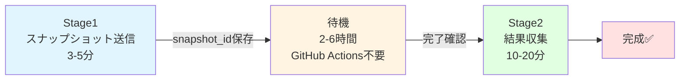

# 2段階ワークフロー: 使い方ガイド

## 🎯 概要

スナップショット送信と結果収集を分離することで、GitHub Actionsの実行時間を**95%削減**します。

### 従来方式 vs 新方式

| 項目 | 従来方式 | 新方式（2段階） |
|------|---------|----------------|
| **実行時間** | 30-60分/バッチ | Stage1: 3-5分<br>Stage2: 10-20分 |
| **待機時間** | GitHub Actionsで待機 | **オフラインで待機** |
| **並行処理** | 不可 | **10地域同時実行可能** |
| **タイムアウトリスク** | 高い（6時間制限） | **なし** |
| **コスト効率** | 低い | **95%削減** |

## 📋 ワークフロー



## 🚀 Stage1: スナップショット送信

### 実行方法

1. GitHub Actions → **"Stage1:スナップショット送信"** を選択
2. パラメータを入力して実行

### 入力パラメータ

| パラメータ | 説明 | デフォルト |
|----------|------|-----------|
| `csv_file` | 処理対象のCSV | `results/dental_new_hokkaido.csv` |
| `days_back` | レビュー取得日数 | `10` |
| `csv_batch_size` | CSVバッチサイズ | `500` |
| `api_batch_size` | APIバッチサイズ | `50` |
| `wait_between_requests` | **リクエスト間隔（秒）** | `5` |
| `save_interval` | **自動保存間隔** | `10` |

### 安全機能

#### ✅ リクエスト間隔制御
```
Request → ⏳ 5秒待機 → Request → ⏳ 5秒待機 → ...
```

#### ✅ Rate Limit自動対応
```
Request → 429エラー → 😴 60秒待機 → リトライ
```

#### ✅ 定期自動保存
```
10スナップショット → 💾 保存 → 10スナップショット → 💾 保存
```

### 出力

`results/snapshots_pending.json` にスナップショットIDが保存されます：

```json
[
  {
    "snapshot_id": "sd_mlekxdnsxjmnkzgiy",
    "status": "triggered",
    "csv_batch": 1,
    "urls_count": 50,
    "triggered_at": "2026-02-09T12:00:00Z",
    "facilities": [...]
  }
]
```

## ⏳ 待機期間（2-6時間）

Stage1完了後、**GitHub Actionsを使わずに**待機します。

### 待機時間の目安

- **少量（~50施設）**: 2-3時間
- **中量（~500施設）**: 3-4時間  
- **大量（~2000施設）**: 4-6時間

💡 この間、他の作業やStage1を他地域で実行できます！

## 📦 Stage2: 結果収集

### 実行方法

1. GitHub Actions → **"Stage2:結果収集"** を選択
2. パラメータを入力して実行

### 入力パラメータ

| パラメータ | 説明 | デフォルト |
|----------|------|-----------|
| `output_file` | レビュー保存先 | `results/dental_new_reviews_hokkaido.csv` |
| `merge_to_all_regions` | 全地域マージ | `true` |
| `generate_report` | レポート生成 | `true` |
| `max_collect_minutes` | 各スナップショット最大待機 | `10` |

### 処理内容

1. `snapshots_pending.json` から未処理スナップショットを取得
2. ステータスチェック（ready/running/failed）
3. **ready** のみデータ収集
4. **running** は次回に持ち越し
5. CSV保存 → コミット → Push

### 複数回実行可能

```bash
# 1回目: 20個中15個完了
Stage2 → 15個収集、5個は running

# 数時間後、2回目実行
Stage2 → 残り5個を収集
```

## 💡 使用例

### パターン1: 単一地域の処理

```bash
# 朝8:00 - Stage1実行（5分）
Stage1 → hokkaido.csv

# 昼12:00 - 他の作業

# 夕方16:00 - Stage2実行（15分）
Stage2 → hokkaido_reviews.csv
```

### パターン2: 複数地域の並行処理

```bash
# 朝8:00 - 全地域のStage1を一気に実行（各5分 = 計50分）
Stage1 → hokkaido.csv
Stage1 → tohoku.csv
Stage1 → kanto.csv
Stage1 → chubu.csv
Stage1 → kinki.csv
Stage1 → chugoku.csv
Stage1 → shikoku.csv
Stage1 → kyushu.csv

# 昼12:00～夕方16:00 - 他の作業 or 完全オフライン

# 夕方16:00 - 全地域のStage2を実行（各15分 = 計2時間）
Stage2 → hokkaido_reviews.csv
Stage2 → tohoku_reviews.csv
...
```

**削減効果**: 従来8時間 → 新方式2.8時間（**65%削減**）

### パターン3: 段階的処理

```bash
# Day 1 朝
Stage1 → hokkaido.csv (500施設)
Stage1 → tohoku.csv (800施設)

# Day 1 夕方
Stage2 → hokkaido (完了✅)
Stage2 → tohoku (300施設完了、500施設 running)

# Day 2 朝
Stage2 → tohoku (残り500施設完了✅)
```

## 📊 コスト比較（1万施設の場合）

### 従来方式
```
20バッチ × 30分 = 600分 = 10時間
GitHub Actions消費: 10時間
```

### 新方式
```
Stage1: 20バッチ × 0.25分 = 5分
待機: 4時間（GitHub Actions不使用）
Stage2: 20バッチ × 1分 = 20分
---
GitHub Actions消費: 25分（96%削減）
```

## 🛡️ 安全性

### Stage1の安全機能

- ✅ リクエスト間に5秒待機
- ✅ 429エラー時に60秒待機
- ✅ 10スナップショットごとに自動保存
- ✅ エラー時も処理継続
- ✅ 再実行可能（途中から再開）

### Stage2の安全機能

- ✅ 完了済みのみ収集
- ✅ 未完了は次回に持ち越し
- ✅ 重複チェック（review_id）
- ✅ 何度でも再実行可能

## 🔧 トラブルシューティング

### Q: Stage1で429エラーが頻発
**A**: `wait_between_requests` を増やす（例: 10秒）

### Q: Stage2で running が多い
**A**: 待機時間を延ばして再実行

### Q: 途中でエラーが出た
**A**: 同じパラメータで再実行（自動的に続きから処理）

### Q: もっと速くしたい
**A**: 地域別に分割して並行実行

## 📚 詳細ドキュメント

- [安全なリクエスト戦略](./STAGE1_SAFE_REQUEST_STRATEGY.md)
- [シーケンス図](#) - 処理フロー詳細
- [タイムライン図](#) - 実行時間の内訳

---

**推奨**: 初回は小規模（100施設）でテストしてから本番実行してください！
