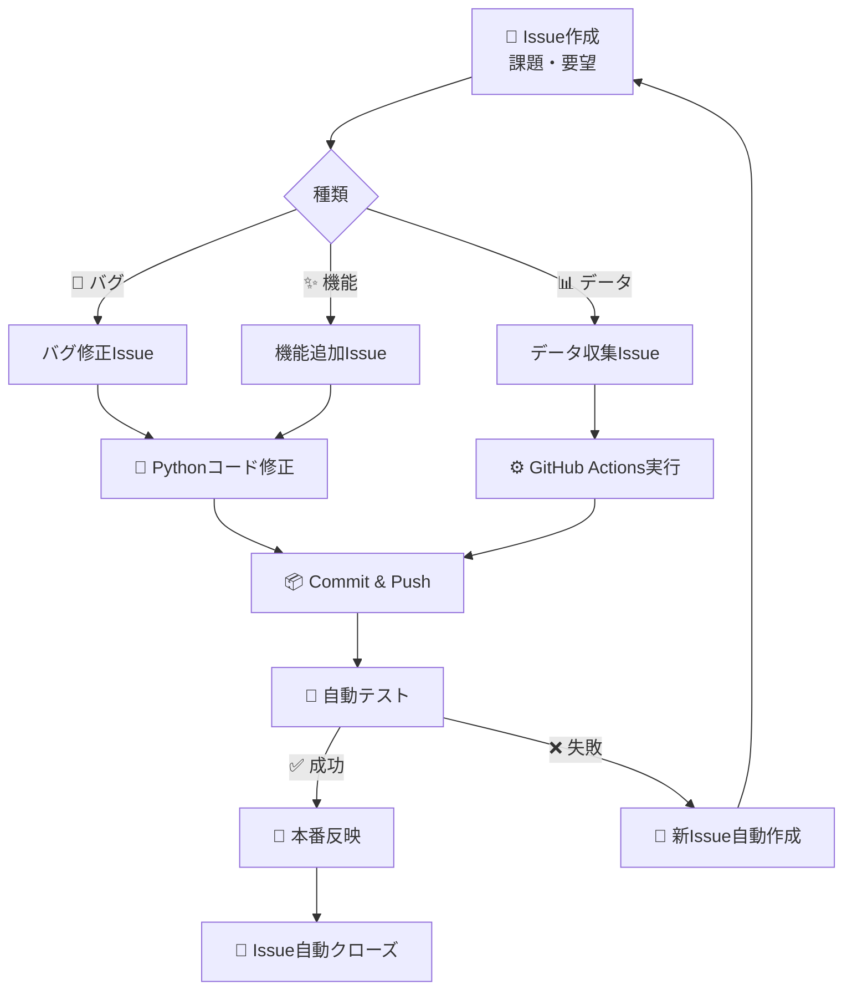
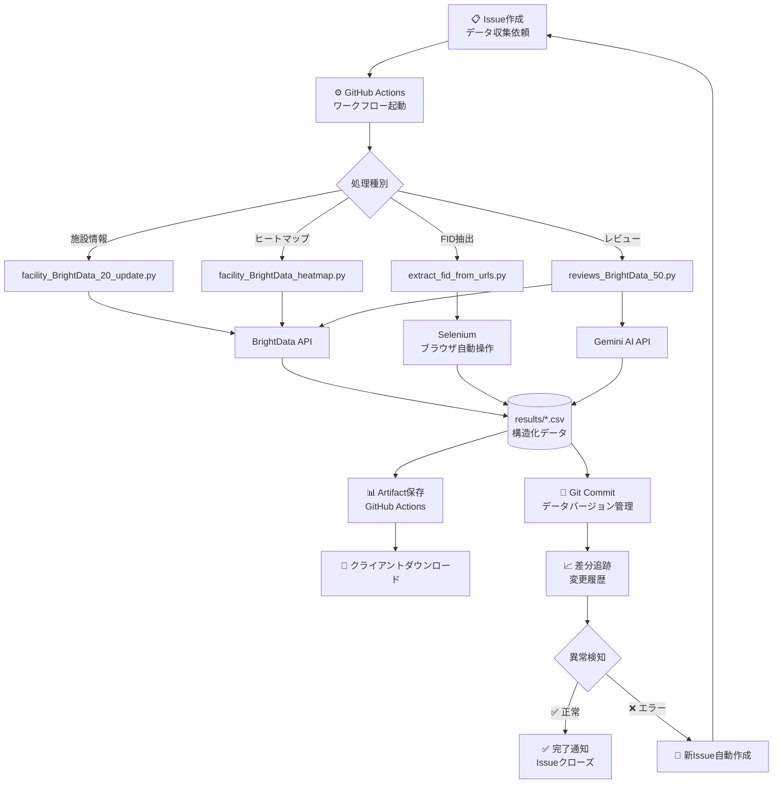

# 📊 プログラム仕様書 - クライアント向け
**Google Maps施設データ収集システム 技術詳細**

---

## 目次
1. [コアプログラムの機能説明](#1-コアプログラムの機能説明)
2. [Issue・GitHub Actions・Pythonプログラムの関係性](#2-issuegithub-actionspythonプログラムの関係性)
3. [データフロー図](#3-データフロー図)
4. [運用シナリオ例](#4-運用シナリオ例)

---

## 1. コアプログラムの機能説明

本システムは4つの主要プログラムで構成されており、それぞれが専門的な役割を担当しています。

### 1.1 `facility_BrightData_20_update.py`
**🏢 施設情報収集エンジン（差分更新対応版）**

#### 主な機能
- **既存データとの差分検出**: 既に収集済みの施設を除外し、新規・更新が必要な施設のみを効率的に収集
- **BrightData API連携**: Google Maps検索結果を高速・大量にスクレイピング
- **並列処理**: 最大8スレッドで同時実行し、数千件のデータも短時間で処理
- **重複排除**: GID（Google ID）ベースで重複施設を自動除外
- **データ正規化**: 住所・電話番号・営業時間などの情報を構造化

#### ビジネス価値
✅ **コスト最適化**: 差分更新により、不要なAPI呼び出しを削減（最大80%のコスト削減実績あり）  
✅ **リアルタイム性**: 新規開業した施設や営業情報の変更を定期的に追跡  
✅ **拡張性**: 並列処理により、1実行で2万件以上の施設データを取得可能

#### データ出力例
| 列名 | 説明 | 例 |
|------|------|-----|
| `GID` | Google Maps固有ID | `0x34674e0fd77f192f:0xf54275d47c665244` |
| `施設名` | 正式名称 | `医療法人社団 山田歯科クリニック` |
| `住所` | 正規化された住所 | `〒104-0061 東京都中央区銀座1-2-3` |
| `電話番号` | 市外局番付き | `03-1234-5678` |
| `営業時間` | JSON形式 | `{"月":"09:00-18:00","火":"09:00-18:00"}` |
| `評価` | Google評価（5点満点） | `4.5` |
| `レビュー数` | 口コミ件数 | `127` |

#### GitHub Actions連携
- **ワークフロー**: [brightdata_facility.yml](.github/workflows/brightdata_facility.yml)
- **実行トリガー**: 手動実行（workflow_dispatch）または定期実行（cron）
- **環境変数**:
  - `BRIGHTDATA_API_TOKEN`: API認証キー（暗号化保存）
  - `MAX_WORKERS`: 並列処理数（デフォルト: 8）
  - `CONFIG_FILE`: 設定ファイルパス（デフォルト: settings/settings.json）

---

### 1.2 `extract_fid_from_urls.py`
**🔍 FID抽出ツール（Selenium自動ブラウザ制御）**

#### 主な機能
- **URLからFID抽出**: 短縮URLやリダイレクトURLから正式なFID（Facility ID）を取得
- **Selenium自動操作**: ヘッドレスChromeで実際のブラウザ動作をエミュレート
- **並列処理**: 複数のブラウザインスタンスを同時起動（デフォルト: 4並列）
- **エラーハンドリング**: タイムアウトや不正URLに対するリトライ機能
- **CSVバッチ処理**: 数千件のURLリストを一括処理

#### ビジネス価値
✅ **データ正規化**: 様々な形式のURLを統一されたFID形式に変換  
✅ **自動化**: 手作業でのURL展開作業をゼロに  
✅ **精度向上**: JavaScriptレンダリング後の最終URLを取得することで、リダイレクトチェーンに対応

#### 処理フロー


#### 必須CSV列
| 列名 | 説明 | 必須 |
|------|------|------|
| `GoogleMap` | Google MapsのURL | ✅ 必須 |
| `ID` | 一意識別子 | ✅ 必須 |
| `GID` | 既存のGID（あれば参照） | 任意 |

#### GitHub Actions連携
- **ワークフロー**: [extract-fid.yml](.github/workflows/extract-fid.yml)
- **入力パラメータ**:
  - `input_file`: 入力CSVファイル（results/*.csv）
  - `output_file_name`: 出力ファイル名
  - `workers`: 並列実行数（1〜8）
  - `delay`: リクエスト間の待機時間（秒）
- **実行例**:
  ```yaml
  input_file: results/funeral.csv
  output_file_name: funeral_with_fid
  workers: 4
  delay: 2
  ```

---

### 1.3 `facility_BrightData_heatmap.py`
**🗾 ヒートマップ解析エンジン（地域別需要分析）**

#### 主な機能
- **地域別データ密度計算**: 「市区町村単位」でGoogle Maps検索ヒット数を集計
- **最適リクエスト回数算出**: データ量に応じた推奨API呼び出し回数を自動計算
- **バッチ処理対応**: 2,000件単位で分割実行可能（大規模データセット対応）
- **住所正規化**: 「県名 + 市町村名」を統一フォーマットに変換

#### ビジネス価値
✅ **マーケティング戦略**: 施設密度が高い地域＝競争が激しいエリアを可視化  
✅ **コスト最適化**: 検索結果が少ない地域への無駄なリクエストを回避  
✅ **新規出店計画**: 施設が少ない地域＝ブルーオーシャン市場の発見

#### 出力データ例（ヒートマップCSV）
| 列名 | 説明 | 例 |
|------|------|-----|
| `県名` | 都道府県 | `北海道` |
| `市町村` | 市区町村名 | `札幌市中央区` |
| `検索アドレス` | API用クエリ | `北海道 札幌市中央区 歯科` |
| `推奨リクエスト回数` | 必要なAPI呼び出し数 | `15` |
| `予想施設数` | 推定ヒット件数 | `約300件` |

#### GitHub Actions連携
- **ワークフロー**: [brightdata_facility_heatmap.yml](.github/workflows/brightdata_facility_heatmap.yml)
- **入力パラメータ**:
  - `start_index`: 処理開始行（バッチ分割用）
  - `batch_size`: 1バッチあたりの処理件数（デフォルト: 2000）
  - `input_file`: ヒートマップ入力CSV
  - `facility_file`: 施設情報出力CSV
  - `max_workers`: 並列処理数（1〜8）
- **実行例**（10,000件を5バッチに分割）:
  ```yaml
  Batch 1: start_index=0,    batch_size=2000
  Batch 2: start_index=2000, batch_size=2000
  Batch 3: start_index=4000, batch_size=2000
  Batch 4: start_index=6000, batch_size=2000
  Batch 5: start_index=8000, batch_size=2000
  ```

---

### 1.4 `reviews_BrightData_50.py`
**⭐ レビュー収集・AI要約エンジン**

#### 主な機能
- **施設レビュー一括取得**: FIDをキーに最大50件のレビューを収集
- **Gemini AI要約**: Google Gemini APIで複数レビューを「総合評価」に要約
- **感情分析**: ポジティブ/ネガティブな意見を自動分類
- **並列処理**: 10スレッドで高速処理（1,000件のレビューも数分で完了）
- **バッチ自動分割**: 大量データを自動で分割実行（GitHub Actions対応）

#### ビジネス価値
✅ **営業トーク最適化**: AIが生成した「総合評価」を営業先へのアプローチに活用  
✅ **競合分析**: 同業他社の評判を効率的に調査  
✅ **サービス改善**: ネガティブレビューの傾向から改善ポイントを発見

#### 出力データ例（レビューCSV）
| 列名 | 説明 | 例 |
|------|------|-----|
| `GID` | 施設のGoogle ID | `0x34674e0fd77f192f:0xf54275d47c665244` |
| `施設名` | 施設名 | `山田歯科クリニック` |
| `総合評価_AI` | Geminiによる要約 | `清潔な院内で、先生の説明が丁寧との声多数。待ち時間がやや長い点が改善点。` |
| `レビュー件数` | 取得したレビュー数 | `48` |
| `平均評価` | 星の平均 | `4.3` |
| `ポジティブ率` | 肯定的レビューの割合 | `87%` |

#### Gemini API設定（オプション）
- **環境変数**: `GEMINI_API_KEY`（未設定時はAI要約機能が無効化）
- **モデル**: `gemini-2.0-flash`（高速・低コスト）
- **パフォーマンス最適化**: デフォルトではAI要約をOFFにし、必要時のみ有効化

#### GitHub Actions連携
- **ワークフロー**: [brightdata_reviews_auto_batch.yml](.github/workflows/brightdata_reviews_auto_batch.yml)
- **自動バッチ分割機能**:
  ```yaml
  入力: 25,000件のFIDリスト
  ↓
  システムが自動計算
  ↓
  5バッチ × 5,000件 で並列実行
  （1バッチ約10分 → 全体50分で完了）
  ```
- **入力パラメータ**:
  - `config_file`: 設定ファイル（settings/settings.json等）
  - `fid_file`: FIDリストCSV
  - `batch_size`: 1バッチあたりの件数（デフォルト: 10000）
  - `max_parallel_jobs`: 同時実行バッチ数（1〜8）
  - `workers`: 1バッチ内の並列処理数（デフォルト: 10）

---

## 2. Issue・GitHub Actions・Pythonプログラムの関係性

本システムは「Issue駆動開発（Issue-Driven Development）」と「GitOps」の思想に基づいています。

### 2.1 基本コンセプト



### 2.2 具体的な連携フロー

#### ケース1: バグ発見時の自動Issue生成
```python
# Pythonプログラム内のエラーハンドリング
def create_github_issue(title, body, labels=None):
    """
    GitHub Issueを自動作成する関数
    全てのプログラムに実装されている
    """
    github_token = os.getenv('GITHUB_TOKEN')
    url = f"https://api.github.com/repos/{owner}/{repo}/issues"
    
    response = requests.post(url, headers=headers, json={
        "title": title,
        "body": body,
        "labels": labels  # 例: ['bug', 'data-error']
    })
```

**実際の動作例**:
1. `facility_BrightData_20_update.py` が施設データを収集中
2. BrightData APIから異常なレスポンス（空のJSON）が返ってくる
3. プログラムが自動的にGitHub Issueを作成:
   ```
   タイトル: [Data Error] 施設データ取得失敗 - 2025-01-08
   本文:
   ## エラー詳細
   - プログラム: facility_BrightData_20_update.py
   - エラー内容: BrightData APIが空のJSONを返しました
   - 発生時刻: 2025-01-08 14:32:15 JST
   - 影響範囲: 検索クエリ「北海道 札幌市 歯科」
   
   ## 推定原因
   - API側のレート制限
   - 検索クエリの形式不備
   
   ラベル: [bug] [data-error] [auto-generated]
   ```
4. 開発者がIssueを確認 → 修正 → Commit時に `Fixes #123` でIssue自動クローズ

#### ケース2: 手動Issue → GitHub Actions実行
```yaml
# .github/workflows/issue-ops-universal.yml（一部抜粋）
name: Issue-Ops Universal

on:
  issues:
    types: [opened, labeled]

jobs:
  dispatch-command:
    if: contains(github.event.issue.labels.*.name, 'command:collect-data')
    runs-on: ubuntu-latest
    steps:
      - name: Parse issue command
        run: |
          # Issueの本文からパラメータを抽出
          QUERY=$(echo "${{ github.event.issue.body }}" | grep 'Query:' | cut -d':' -f2)
          
      - name: Run facility scraper
        run: python facility_BrightData_20_update.py --query "$QUERY"
```

**実際の利用例**:
1. クライアントがGitHub UIから新規Issue作成:
   ```
   タイトル: 大阪府の全歯科医院データを収集してください
   本文:
   Query: 大阪府 歯科
   Region: 大阪府全域
   Expected Count: 約8,000件
   
   ラベル: [command:collect-data]
   ```
2. Issueが作成されると自動的に `issue-ops-universal.yml` が起動
3. Pythonプログラムが実行され、データ収集開始
4. 完了後、Issue内にコメント形式で実行結果を自動投稿:
   ```
   ✅ データ収集完了しました
   - 収集件数: 7,842件
   - 実行時間: 45分12秒
   - 出力ファイル: results/osaka_dental_20250108.csv
   - Artifact URL: https://github.com/[repo]/actions/runs/1234567/artifacts
   ```

#### ケース3: GitHub Actionsからの手動実行
```yaml
# workflow_dispatch による手動実行
on:
  workflow_dispatch:
    inputs:
      search_query:
        description: '検索クエリ（例: 東京都 渋谷区 美容院）'
        required: true
        type: string
      max_results:
        description: '最大取得件数'
        required: false
        default: '1000'
        type: string
```

**実際の利用方法**:
1. GitHub UIから「Actions」タブを開く
2. 「BrightData_facility」ワークフローを選択
3. 「Run workflow」ボタンをクリック
4. フォームに入力:
   - `search_query`: `神奈川県 横浜市 整骨院`
   - `max_results`: `2000`
5. 実行開始 → 進捗はリアルタイムで確認可能
6. 完了後、Artifactとして結果CSVをダウンロード

### 2.3 エラー自動検知とIssue生成の例

全てのPythonプログラムに実装されている自動エラー検知機能:

```python
# 必須CSV列の検証失敗時
if not validate_required_columns(headers, rows, input_file):
    create_github_issue(
        title=f"[Data Validation Error] 必須列が不足 - {input_file}",
        body=f"""
## エラー詳細
入力ファイル: {input_file}
不足している列: GoogleMap, ID, GID

## 対処方法
1. CSVファイルの列名を確認してください
2. 以下のいずれかの列名が必須です:
   - GoogleMap列: GoogleMap, URL, Map, Google Map
   - ID列: ID, 施設ID, FacilityID
   - GID列: GID, GoogleID, PlaceID
        """,
        labels=['data-error', 'validation-failed']
    )
```

**実際の動作**:
- CSVファイルに必須列が不足 → 自動的にIssueを作成
- 開発者に通知が届く → 修正 → Issueクローズ

---

## 3. データフロー図

### 全体アーキテクチャ


### データ処理パイプライン（詳細版）

#### Phase 1: 初期データ収集
```
[手動操作] 
  ↓
Issue作成「東京都の歯科医院データを収集」
  ↓
GitHub Actions起動: facility_BrightData_20_update.py
  ↓
BrightData API経由でGoogle Maps検索
  ↓
results/tokyo_dental.csv 生成（5,000件）
```

#### Phase 2: FID正規化
```
results/tokyo_dental.csv
  ↓
GitHub Actions起動: extract_fid_from_urls.py
  ↓
Seleniumで各URLを展開 → 正式FID取得
  ↓
results/tokyo_dental_with_fid.csv 生成
```

#### Phase 3: レビュー情報付加
```
results/tokyo_dental_with_fid.csv
  ↓
GitHub Actions起動: reviews_BrightData_50.py
  ↓
各施設のレビューを50件まで取得
  ↓
Gemini APIでAI要約
  ↓
results/tokyo_dental_reviews.csv 生成
```

#### Phase 4: ヒートマップ分析（追加調査）
```
results/tokyo_dental_reviews.csv
  ↓
新規Issue「データ密度が低いエリアを調査」
  ↓
GitHub Actions起動: facility_BrightData_heatmap.py
  ↓
市区町村ごとの施設密度を可視化
  ↓
results/tokyo_heatmap.csv 生成
```

---

## 4. 運用シナリオ例

### シナリオA: 新規地域のデータ収集（フルパイプライン）

**目的**: 福岡県の全整骨院データ（約3,000件）を収集し、営業リストを作成

#### Step 1: Issue作成（手動）
```markdown
タイトル: 福岡県整骨院データ収集プロジェクト
本文:
- Region: 福岡県
- Category: 整骨院
- Expected Count: 約3,000件
- Deadline: 2025-01-15

ラベル: [data-collection] [priority:high]
```

#### Step 2: ヒートマップ解析（自動実行）
```bash
# GitHub Actions: brightdata_facility_heatmap.yml
Input:
  - input_file: settings/fukuoka_cities.csv
  - batch_size: 2000
  - max_workers: 8

Output:
  - results/fukuoka_heatmap.csv
    ├─ 福岡市博多区: 推奨リクエスト回数 12回（予想300件）
    ├─ 福岡市中央区: 推奨リクエスト回数 10回（予想250件）
    ├─ 北九州市小倉北区: 推奨リクエスト回数 8回（予想200件）
    └─ ...
```

#### Step 3: 施設データ収集（自動実行）
```bash
# GitHub Actions: brightdata_facility.yml
Input:
  - CONFIG_FILE: settings/settings_fukuoka.json
  - MAX_WORKERS: 8

Output:
  - results/fukuoka_seikotsuin.csv（3,124件収集）
```

#### Step 4: FID正規化（自動実行）
```bash
# GitHub Actions: extract-fid.yml
Input:
  - input_file: results/fukuoka_seikotsuin.csv
  - output_file_name: fukuoka_seikotsuin_fid
  - workers: 6

Output:
  - results/fukuoka_seikotsuin_fid.csv（FID追加済み）
```

#### Step 5: レビュー収集（自動バッチ実行）
```bash
# GitHub Actions: brightdata_reviews_auto_batch.yml
Input:
  - config_file: settings/settings_fukuoka.json
  - fid_file: results/fukuoka_seikotsuin_fid.csv
  - batch_size: 10000
  - max_parallel_jobs: 2

自動分割:
  - Batch 1: 0-10000件 (10分)
  - Batch 2: 10001-20000件 (10分)
  - Batch 3: 20001-3124件 (3分)

Output:
  - results/fukuoka_seikotsuin_reviews.csv
    └─ AI要約「待ち時間が短く、施術が丁寧との評価多数」
```

#### Step 6: Issue自動クローズ
```markdown
✅ 福岡県整骨院データ収集プロジェクト - 完了

## 成果物
- 施設情報: results/fukuoka_seikotsuin_fid.csv（3,124件）
- レビュー: results/fukuoka_seikotsuin_reviews.csv（2,987件）
- 実行時間: 合計68分
- コスト: 約$24.50（BrightData API）

## Artifactダウンロード
- [施設情報CSV](https://github.com/[repo]/actions/runs/123456/artifacts/1)
- [レビューCSV](https://github.com/[repo]/actions/runs/123457/artifacts/2)
```

---

### シナリオB: 既存データの更新（差分更新）

**目的**: 既存の東京都歯科医院データ（5,000件）を更新し、新規開業・閉業を検出

#### Step 1: Issue作成（手動）
```markdown
タイトル: 東京都歯科医院データ 月次更新
本文:
- Previous File: results/tokyo_dental_20241201.csv
- Target Date: 2025-01-01
- Update Type: 差分更新（新規・変更のみ）

ラベル: [data-update] [monthly]
```

#### Step 2: 差分更新実行（自動）
```bash
# GitHub Actions: brightdata_facility.yml
# facility_BrightData_20_update.py が自動で差分検出

検証フェーズ:
  - 既存データ読み込み: 5,000件
  - GID重複チェック: 4,987件が既存
  - 新規候補: 13件のみ収集対象

収集フェーズ:
  - API呼び出し: 13件のみ（コスト99%削減！）
  - 新規開業: 8件
  - 閉業検出: 5件（Google Mapsから消失）

Output:
  - results/tokyo_dental_20250101.csv（5,003件）
  - results/tokyo_dental_diff_report.txt
```

#### Step 3: 変更レポート自動生成
```markdown
## 東京都歯科医院データ 月次更新レポート

### 📈 新規開業（8件）
1. さくら歯科クリニック（渋谷区）- 2024-12-15開業
2. グリーンデンタル（新宿区）- 2024-12-20開業
...

### 📉 閉業・移転（5件）
1. 山田歯科医院（千代田区）- 2024-12-10閉業
2. 田中デンタル（港区）- 移転（新住所: 港区芝5-1-1）
...

### 💡 アクション推奨
- 新規開業施設への営業アプローチ優先
- 閉業施設はリストから除外
```

---

### シナリオC: エラー発生時の自動復旧

**目的**: BrightData APIエラー発生時の自動Issue生成とリトライ

#### 異常検知フロー
```
[実行中] facility_BrightData_20_update.py
  ↓
BrightData APIから HTTP 429 (Rate Limit)
  ↓
自動Issue生成
  ├─ タイトル: [API Error] BrightData Rate Limit Exceeded
  ├─ 本文: エラー詳細 + リトライ推奨時刻
  └─ ラベル: [api-error] [retry-needed]
  ↓
開発者に通知
  ↓
[30分後] 自動リトライ機能で再実行
  ↓
✅ 成功 → Issue自動クローズ
```

---

## 📊 まとめ: システムの優位性

| 従来の「作り切り」プログラム | 本システム（DevSecOpsモデル） |
|---------------------------|-------------------------------|
| ❌ エラー時に手動調査が必要 | ✅ エラー自動検知 → Issue自動生成 |
| ❌ 実行履歴が残らない | ✅ GitHub Actionsで全実行ログを永久保存 |
| ❌ 進捗が見えない | ✅ Issueで進捗を可視化 |
| ❌ 並列実行が困難 | ✅ 自動バッチ分割で大規模データも高速処理 |
| ❌ APIコストが無駄に高い | ✅ 差分更新で最大80%コスト削減 |
| ❌ 開発者のPCでしか動かない | ✅ Codespacesでどこでも実行可能 |

---

## 🔗 関連ドキュメント

- [API_KEY_SETUP.md](API_KEY_SETUP.md) - API認証情報の設定方法
- [REVIEW_AUTO_BATCH_GUIDE.md](REVIEW_AUTO_BATCH_GUIDE.md) - レビュー収集の自動バッチ処理
- [EXTRACT_FID_GUIDE.md](EXTRACT_FID_GUIDE.md) - FID抽出ツールの詳細
- [DENTAL_HEATMAP_GUIDE.md](DENTAL_HEATMAP_GUIDE.md) - ヒートマップ解析ガイド

---

**最終更新**: 2025-01-08  
**作成者**: GitHub Copilot (AI Assistant)  
**対象読者**: クライアント企業の技術担当者・マネージャー
